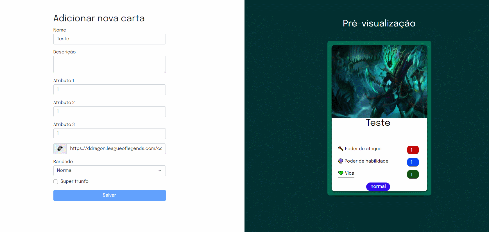

## Tryunfo

Tecnlogias utilizadas:
- React
- JavaScript

Projeto que deixa você criar cartas do jogo trunfo escolhendo seus atributos, podendo criar cartas personalizadas somente suas! Neste projeto aprendi sobre como controlar forms em React.

